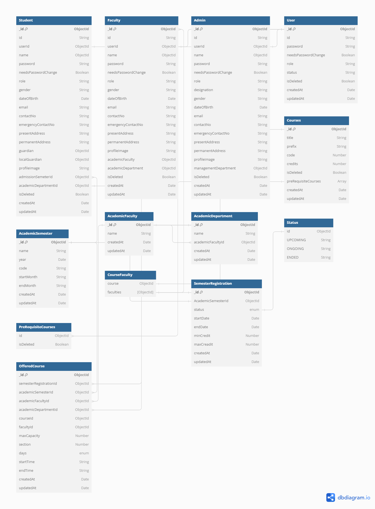

# University Management System Requirement Analysis

## Functional Requirements

1. **Authentication:**

   - **Student:**
     - Student can login and logout securely
     - Student can update their password
   - **Faculty:**
     - Faculty can login and logout securely
     - Faculty can update their password
   - **Admin:**
     - Admin can login and logout securely
     - Admin can update their password

1. **Profile Management:**

   - **Student:**
     - Students can manage and update their profile
     - students can update certain fields
   - **Faculty:**
     - Faculty can manage and update their profile
     - Faculty can update certain fields
   - **Admin:**
     - Admin can manage and update their profile
     - Admin can update certain fields

1. **Academic Process:**
   - **Student:**
     - Student can enroll in offered courses for a specific semester
     - Students can view their class schedule
     - Students can see their grades
     - Students can view notice board and events
   - **Faculty:**
     - Faculty can manage students grades
     - Faculty can access students personal and academic information
   - **Admin:**
     - Admin can manage multiple processes:
       - Semester
       - Course
       - Offered Course
       - Section
       - Room
       - Building
1. **User Management:**
   - **Admin:**
     - Admin can manage multiple accounts
     - Admin can block/unblock user
     - Admin change user password

## Mongoose Data Model

1. **Student:**

```mongodb
    _id: ObjectId
    id: String
    userId: ObjectId
    name: String
    password: String
    needsPasswordChange: Boolean
    role: String
    gender: String
    dateOfBirth: String
    email: String
    contactNo: String
    emergencyContactNo: String
    presentAddress: String
    permanentAddress: String
    guardian: ObjectId
    localGuardian: ObjectId
    profileImage: String
    academicSemesterId: ObjectId
    academicDepartmentId: ObjectId
    isDeleted: Boolean
    createdAt: Date
    updatedAt: Date
```

2. **Faculty:**

```mongodb
   _id: ObjectId
   id: String
   userId: ObjectId
   name: ObjectId
   gender: String
   dateOfBirth: String
   email: String
   contactNo: String
   emergencyContactNo: String
   presentAddress: String
   permanentAddress: String
   profileImage: String
   academicFacultyId: ObjectId
   academicDepartmentId: ObjectId
   isDeleted: Boolean
   createdAt: Date
   updatedAt: Date
```

3. **Admin:**

```mongodb
   _id: ObjectId
   id: String
   userId: ObjectId
   name: String
   designation: String
   gender: String
   dateOfBirth: String
   email: String
   contactNo: String
   emergencyContactNo: String
   presentAddress: String
   permanentAddress: String
   profileImage: String
   managementDepartmentId: ObjectId
   isDeleted: Boolean
   createdAt: Date
   updatedAt: Date
```

4. **User:**

```mongodb
    _id: ObjectId
    id: String
    password: String
    needsPasswordChange: Boolean
    role: String
    status: String
    createdAt: Date
    updatedAt: Date
```

5. **Academic Semester:**

```mongodb
    _id: ObjectId
    name: String
    year: String
    code: String
    startMonth: String
    endMonth: String
    createdAt: Date
    updatedAt: Date
```

6. **Academic Faculty:**

```mongodb
    _id: ObjectId
    name: String
    createdAt: Date
    updatedAt: Date
```

7. **Academic Department:**

```mongodb
    _id: ObjectId
    name: String
    academicFacultyId: ObjectId
    createdAt: Date
    updatedAt: Date
```

8. **Course Model:**

```mongodb
    _id: ObjectId
    title: String
    prefix: String
    code: Number
    credits: Number
    isDeleted: Boolean
    preRequisiteCourses: Array
    createdAt: Date
    updatedAt: Date
```

9. **Course Faculty:**

```mongodb
    course: ObjectId
    faculties: ObjectId
```

## ER Diagram



## API Endpoints

1. **User:**
   - `POST BASE-URL/users/create-student`
   - `POST BASE-URL/users/create-faculty`
   - `POST BASE-URL/users/create-admin`
1. **Student:**
   - `GET BASE-URL/students`
   - `GET BASE-URL/students/:id`
   - `PATCH BASE-URL/students/:id`
   - `DELETE BASE-URL/students/:id`
   - `GET BASE-URL/students/my-profile`
1. **Faculty:**
   - `GET BASE-URL/faculties`
   - `GET BASE-URL/faculties/:id`
   - `PATCH BASE-URL/faculties/:id`
   - `DELETE BASE-URL/faculties/:id`
   - `GET BASE-URL/faculties/my-profile`
1. **Admin:**
   - `GET BASE-URL/admins`
   - `GET BASE-URL/admins/:id`
   - `PATCH BASE-URL/admins/:id`
   - `DELETE BASE-URL/admins/:id`
   - `GET BASE-URL/admins/my-profile`
1. **Course:**

- `POST BASE-URL/courses/create-course`
- `GET BASE-URL/courses`
- `GET BASE-URL/courses/:id`
- `PATCH BASE-URL/courses/:id`
- `DELETE BASE-URL/courses/:id`

1. **Authentication:**
   - `GET BASE-URL/auth/login`
   - `GET BASE-URL/auth/refresh-token`
   - `PATCH BASE-URL/auth/change-password`
   - `DELETE BASE-URL/auth/forget-password`
   - `GET BASE-URL/auth/reset-password`
